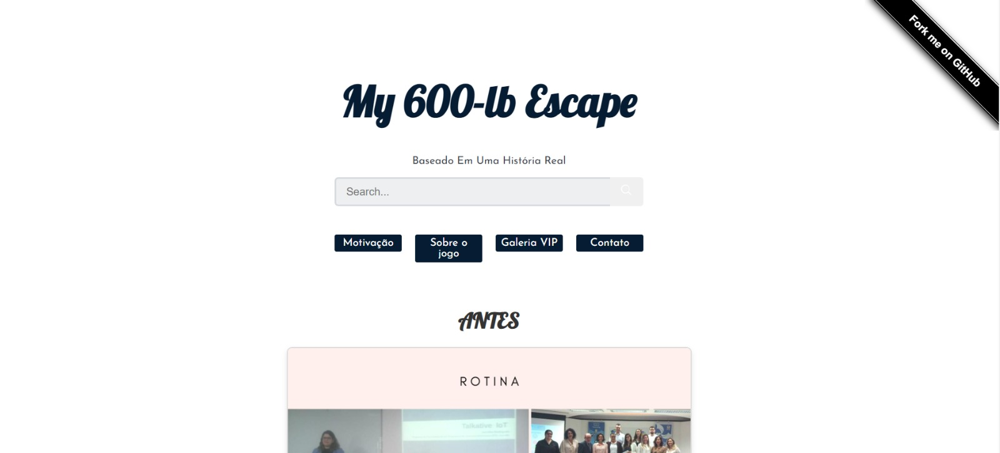

<p align="center">
   
  
 
</p>

<h1 align="center"> My 600-lb Escape - Web Page </h1>
<p align="center">A web page complementing the game with additional features, developed with React and JavaScript.</p>

---

### Description

The **My 600-lb Escape - Web Page** is a React-based frontend application designed to complement the game by offering additional features such as galleries, progress tracking, and user interaction tools.

---

## **Technologies Used**

- **React**: Frontend framework for building the user interface.
- **JavaScript**: Core language for dynamic interactions and functionality.
- **CSS**: Styling for the web page.
- **HTML**: Structure for web-based components.

---

### Getting Started

```bash
# Clone this project
$ git clone https://github.com/JenniferFariasRodrigues/my-600lb-escape-web-page.git

# Access the project directory
$ cd my-600lb-escape-web-page

# Install the dependencies
$ npm install

# Start the development server
$ npm start

# Open your browser and go to:
http://localhost:3000


## Key Features

### **Motivação Section**
- Displays "Before" and "After" images of progress using responsive layouts.
- Images are grouped dynamically for better presentation.
- Stored in `public/media/images`.

---

### **Sobre o jogo**
- Provides details about the game phases.
- Features video previews of the game stages.

---

### **Galeria VIP**
- Includes details about the developer's Instagram account.
- Videos stored in `public/media/videos`.

---

### **Contato Section**
- Lists developer contact information, including:
  - **Email**
  - **LinkedIn**
  - **GitHub**
  - **Instagram**
  - **Stack Overflow**
- Offers a search feature for game-related content.

---

## Application Preview

<p align="center">
 
</p>

---

## Contribution

Feel free to contribute to this project by submitting pull requests. Please ensure your changes are well-tested and documented.

---

## License

This project is licensed under the MIT License - see the LICENSE file for details.


```
